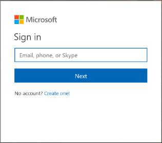
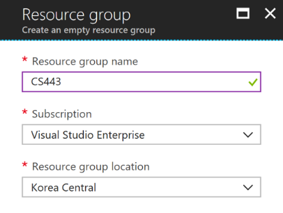
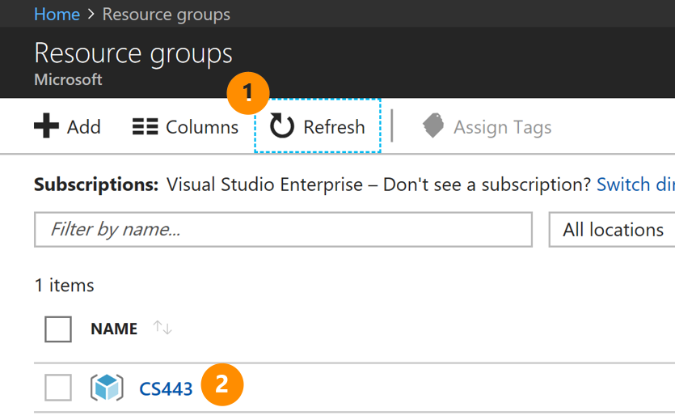
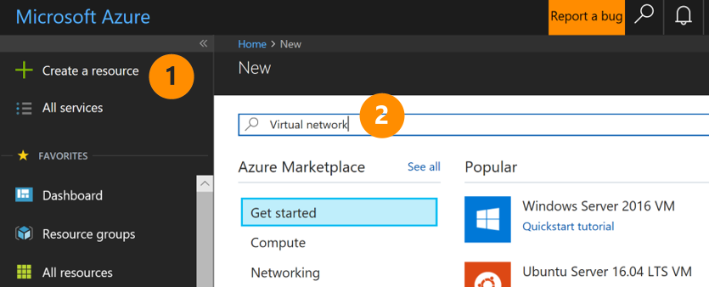
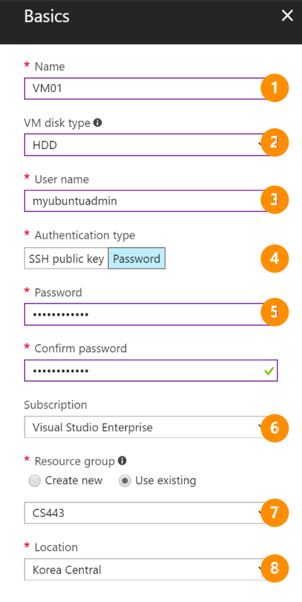

# CS443-Kaist-Fall-2017 #

## Overview ##

This guideline is to aid setup of enviroment for CS443 class in Kaist Fall 2017. Please follow the document step by step and reach your TA or Microsoft when you need more assistance. 

Throughout this practice, you will have twenty Virtual Machine in a single virtual network. Please remind that your credit is limited and make sure that shutting down all the VMs or completely delete the all resource to prevent unnecessary expenditure of credit. In case of credit out, please reach your TA.

## Exercises ##

- [Exercise 1: Create a Microsoft account](#Exercise1)
- [Exercise 2: Subscript Access](#Exercise2)
- [Exercise 3: Azure Portal](#Exercise3)
- [Exercise 4: Resource Group Creation](#Exercise4)
- [Exercise 5: Virtual Network Creation](#Exercise5)
- [Exercise 6: Virtual Machine Creation](#Exercise6)
- [Exercise 6-1: Batch job to create Virtual Machine](#Exercise6-1)
- [Exercise 7: Connect to Virtual Machine](#Exercise7)
- [Exercise 8: Turning off/on Virtual Machine](#Exercise8)
- [Exercise 8-1: Batch job to turn off/on Virtual Machine](#Exercise8-1)
- [Exercise 9: Delete the all resource](#Exercise9)

## Exercise 1: Create a Microsoft account

(You can skip this exercise if you already have it.)

First of all, you need an account to access Microsoft Azure. Microsoft ID can be created by visiting [here](https://account.microsoft.com/account?lang=en-US). If you choose your Organization Account which ends with @kaist.ac.kr, you will see select panel at your every login.

Click 'Sign in with Microsoft' button.

Click 'Create One'.

Hint: You can use any of email account as Microsoft account. Gmail, naver accounts are welcome.

Once you finish Microsoft account creation, you need to submit your account to your TA.

## Exercise 2: Subscription Access

Once you submiited your Microsoft ID, your TA will allow you to access specific Azure Subscription, to utilize proper Azure resources. You can verify your access at [Azure Portal](https://portal.azure.com). 

You will see 'Subscription' menu at left side of portal. Click the button.

Please check the name of Subscription (named by TA) and its credit balance. You can monitor your balance here while you're using several Azure resources.

If your account has Azure history, you may see different Subscriptions, in this case, you need to be careful to select Subscriptions while doing exercise. Provided Subscription is safe to use without any expenditure. 

## Exercise 3: Azure Portal

Congraturations. Now you have full access to Azure and your Subscription to perform your task. Azure Portal is a place to allow users to build, manage, and monitor everything from simple web apps to complex cloud applications in a single, unified consol. For detail, please visit [Azure Portal Introduction](https://azure.microsoft.com/en-us/features/azure-portal/) page.

## Exercise 4: Resource Group Creation

Resource Group is a container that can held the resources you assign from your any of deployments - whether it is a Virtual Machine, Database, or Website. It enables you to group related entities. In this exercise, we will create a single resource group, names 'CS443' and manage the resources inside of it together.

 
1. Click 'Resource groups'. Then blade will pop-up.
2. Click 'Add' to create new resource group.

  
1. Resource group name: you can name by your own.
2. Subscriptions: **Make sure** you're selecting the right Subscription from TA. This is very important to avoid any financial damage for you.
3. Resource group location: you can choose any region in Azure. However, the closer may be better.
4. Click 'Create' button below.

1. By hitting 'Refresh' button above, 
2. You may visually confirm new resource group, you just created.

## Exercise 5: Virtual Network Creation

Now, we need to set up a Virtual Network, to let Azure Resources to securely communicate with others - in this exercise, mainly 20 Virtual Machines. You can refer detail explanation of Azure Virtual Network [here](https://docs.microsoft.com/en-us/azure/virtual-network/virtual-networks-overview). 

Click Microsoft Azure logo at top left. You will go to the default screen.

1. Click 'Create a resource' at your top left.
2. Type 'Virtual network' to search resource we need to create.

 

Choose Virtual network. Set 'Resource Manager' as a deployment model (do not change) and hit 'Create'.

 1. Name your Virtual network as 'CS443-Vnet'.
2. Address Space sets the range of private IP addresses for the Virtual network. Keep the default.
3. Again, make sure your Subscription choice.
4. As we already created resource group, select Use existing button and one.
5. Set your prefered location. It is better to put your resource group, virtual network and virtual machines together in the same region.
6. Subnet. Do not modify.
7. Subnet IP allocation. Do not modify.
8. By clicking 'Pin to dashboard', new icon of virtual network will appear at your dashboard, and you can directly access by clicking the icon.

## Exercise 6: Virtual Machine Creation

Click Microsoft Azure logo at top left. You will go to the default screen.

1. Click 'Create a resource' at your top left. 

    (Hint: In Azure, there are several different way to create new resource.)
2. Type 'Ubuntu' to find Ubuntu server resource.
3. Select 'Ubuntu Server 16.04 LTS VM'.

In Azure, there are four step to create new Virtual Machine.
1. Basic setup
2. Size setup
3. Setting setup
4. Summary and confirm

### Basic setup ###

1. Name your first VM, it is highly recommended to set up a policy to name it as we will manage twenty different VMs.
2. Choose your disk type. HDD is more ecomonic.
3. User name - this is your administrator account for this VM.
4. Auth type - select one you prefer.
5. Password - You can reset at Azure Portal when you forget it.
6. Subscription - Verify again.
7. Choose resource group 'CS443'.
8. Location - Korea Central.

### Choose a size ###
In Azure, many different spec of VM are offered. In this exercise, it is recommended to choose basic model - D1 series. According to your selection of region, option varies. Higher performance VM are more expensive. 

**Azure Virtual Machine charges your credits based on hour, you turn on. It means you can save your credit by turning off when you're not using those. And it is important to delete all of your resource when you finish your task.**

### Settings ###
1. High availbility - Do not need in this exercise.

    Azure automatically fails over guest VMs to a working physical host in a different Fault Domain when an error condition is detected, again aimed at ensuring availability.
2. Storage: Yes
3. Virtual network: CS443-Vnet
4. Subnet: default
5. Public IP address: (new) VM01-ip 
    Azure allowes five public IP for free of charge. You may need public IP only for the first single VM. Later, choose 'none'.
6. Network Security Group(firewall): (new) VM01-nsg. This is only required for the first single VM. Later, you can set the same for the all the left VMs.
7. Diagnostic storage account: This storage account is used to collect your VM's log data. 

After final validation, you can create your first VM.

Note: it may take few minutes to prepare your VM.

## Exercise 7: Connect to Virtual Machine

Open your VM detail menu, by clicking icon at the dashboard or name at your resource group page.

1. Connect: you will get address to connect your VM. [Putty](http://www.chiark.greenend.org.uk/~sgtatham/putty/download.html), [Powershell](https://www.tenforums.com/tutorials/25581-open-windows-powershell-windows-10-a.html) and [Azure CLI](https://docs.microsoft.com/en-us/cli/azure/overview?view=azure-cli-latest) are fine to connect.
2. Start: Once you stop your VM (turned off), you can restart with this button.
3. Restart: You can do restart your VM at Azure portal.
4. Stop: You can stop your VM here. **After your stop and start your VM, data in VM disk will be initialized.**
5. Azure Portal provides CLI enviroment.

